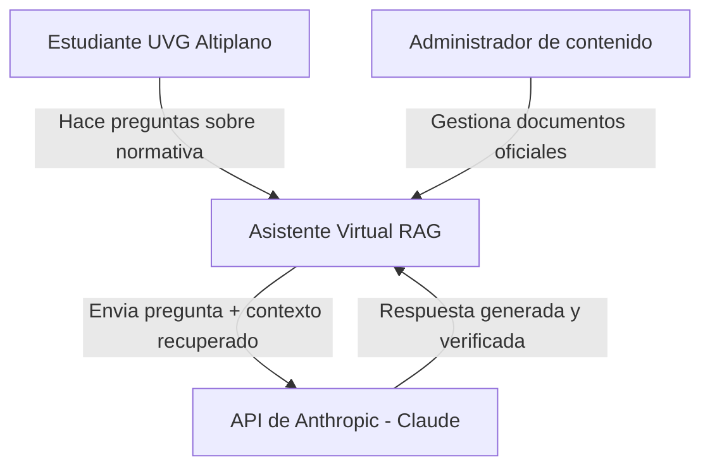
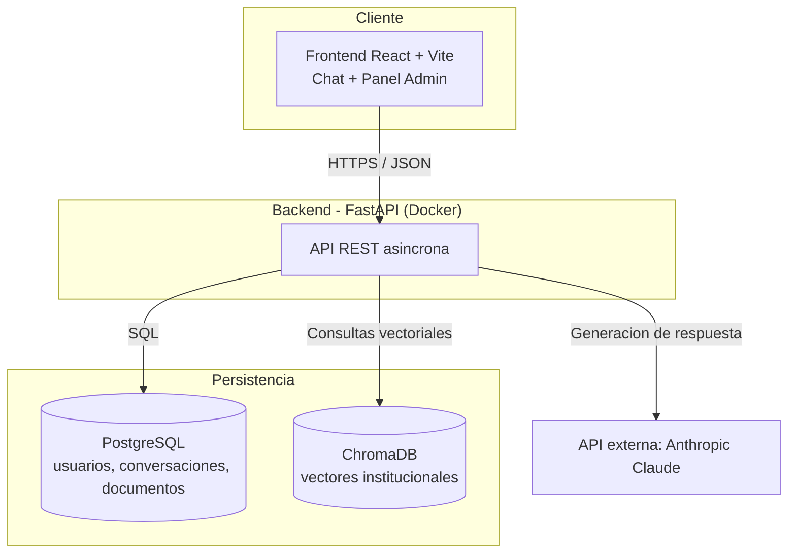
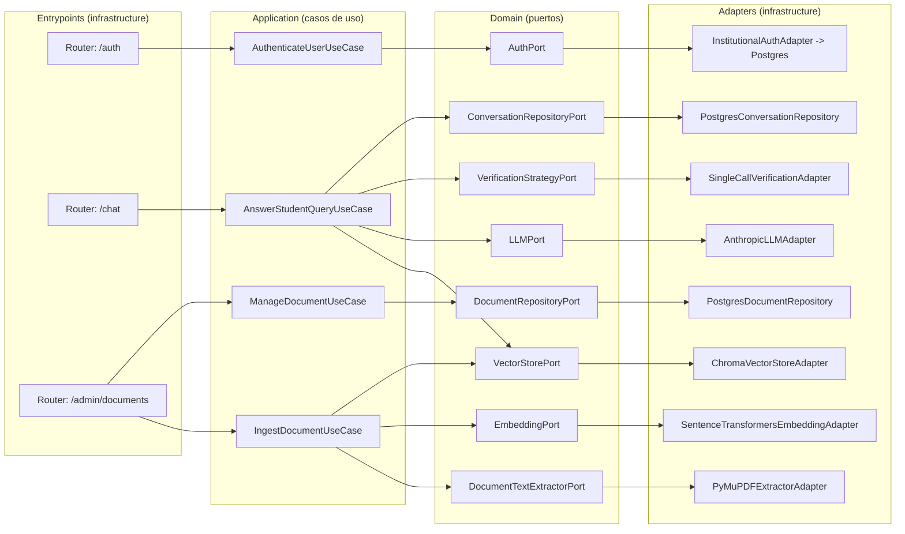
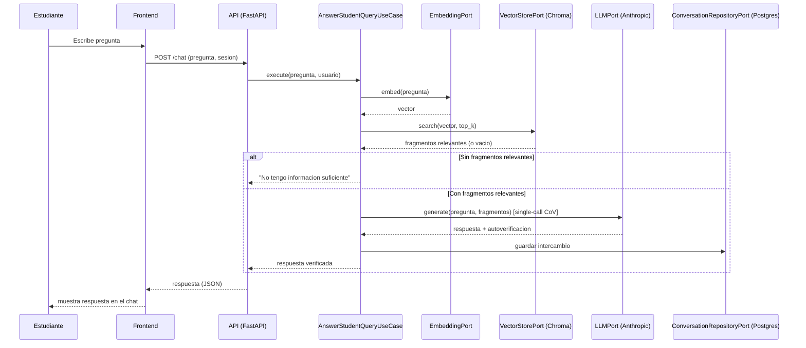
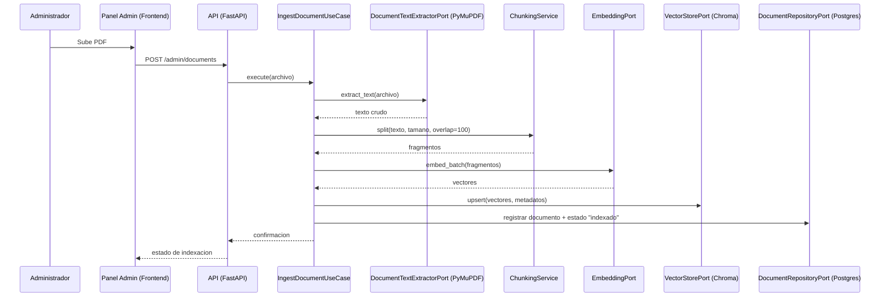
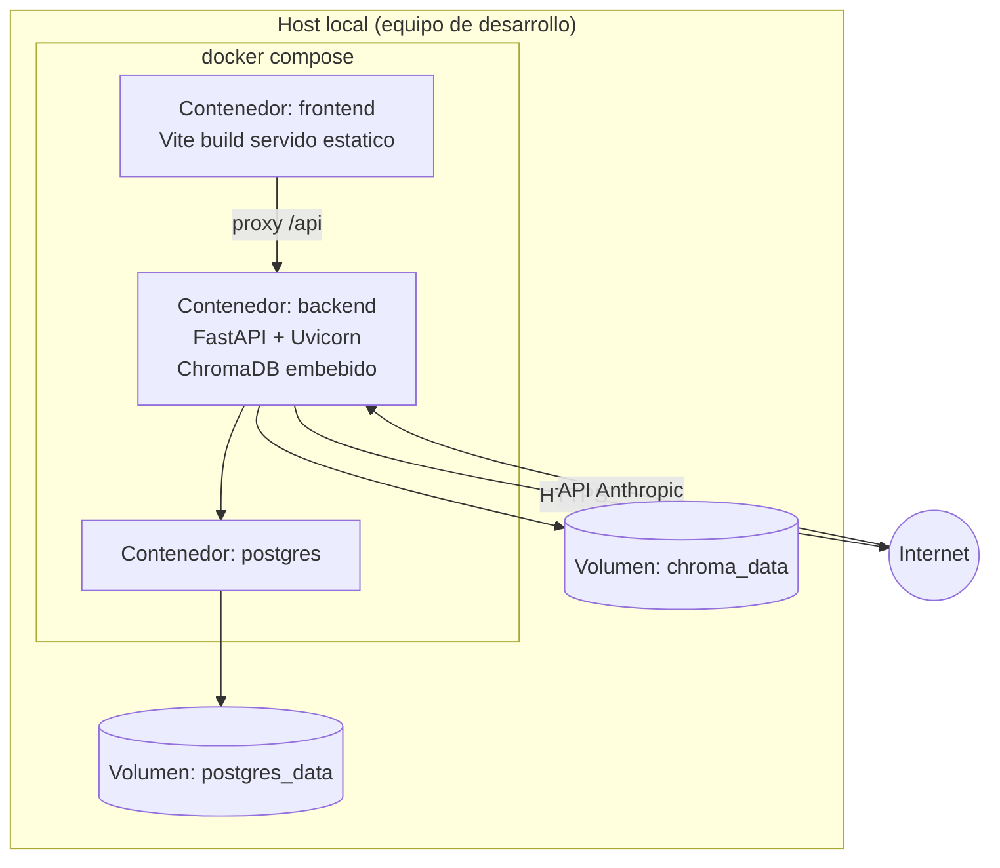

# High Level Architecture

## 1. Diagrama de contexto (C4 — Nivel 1)

El sistema no se integra con ningún otro sistema institucional de UVG (no hay SSO, no hay integración con el sistema académico) — es una decisión de alcance explícita, no una omisión (ver [ADR-0004](adr/0004-institutional-authentication.md)).

## 2. Diagrama de contenedores (C4 — Nivel 2)

Todos los contenedores (frontend, backend, PostgreSQL) se orquestan mediante `docker-compose.yml`. ChromaDB se ejecuta embebido dentro del proceso backend con persistencia en volumen, no como servicio de red aparte — evita un contenedor adicional que el alcance del proyecto no justifica.

## 3. Componentes del backend (C4 — Nivel 3, capa de aplicación)

## 4. Flujo de secuencia — "El estudiante pregunta algo"

## 5. Flujo de secuencia — "Ingesta de un documento nuevo"

## 6. Vista de despliegue

## 7. Evolución futura (documentada, no implementada en esta versión)

Estas mejoras fueron identificadas en el análisis inicial del proyecto como oportunidades válidas, pero deliberadamente no forman parte del MVP dado el presupuesto de tiempo (~21 horas, un desarrollador). Se documentan aquí para que el tribunal vea que fueron consideradas y descartadas por una razón explícita, no por desconocimiento:

- **Recuperación híbrida (BM25 + vectorial):** mejoraría el recall en consultas que citan artículos o números de reglamento exactos. Requiere mantener un índice adicional (p. ej. Whoosh o similar) en paralelo a ChromaDB.
- **Reranking con cross-encoder:** reduciría ruido en el Top-K antes de enviarlo al LLM, mejorando la métrica de fidelidad de RAGAS a costa de latencia adicional.
- **Chunking consciente de estructura legal/normativa:** dividir por artículo/inciso en vez de tamaño fijo, mejorando la coherencia semántica de cada fragmento.
- **Caché semántico de respuestas:** para preguntas frecuentes, evitar una llamada nueva al LLM — impacto directo en NFR-02 (costo).
- **`MultiCallVerificationAdapter`:** implementación real del pipeline de verificación en múltiples llamadas, ya contemplado por el puerto `VerificationStrategyPort` pero no implementado (ver [ADR-0005](adr/0005-chain-of-verification-strategy.md)).
